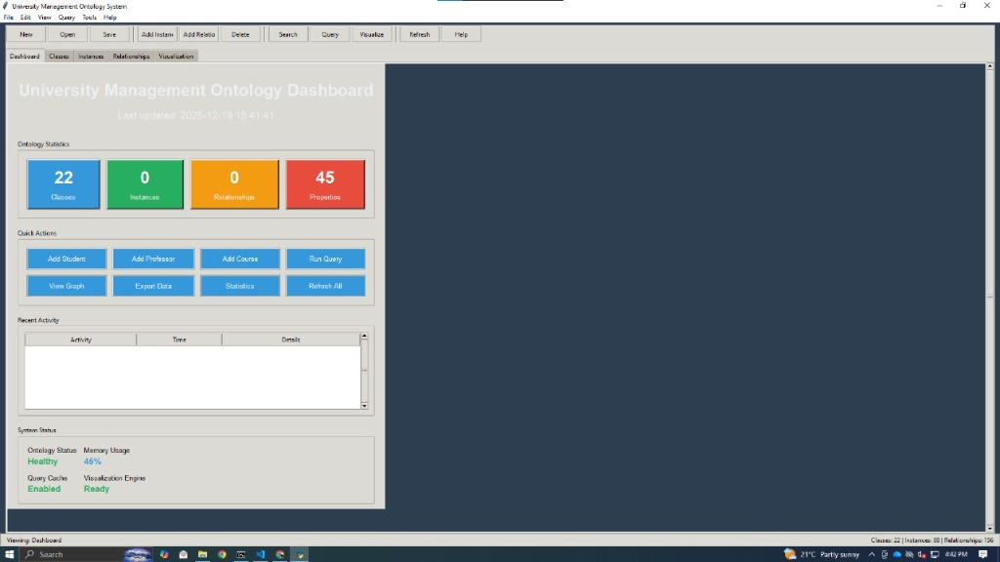
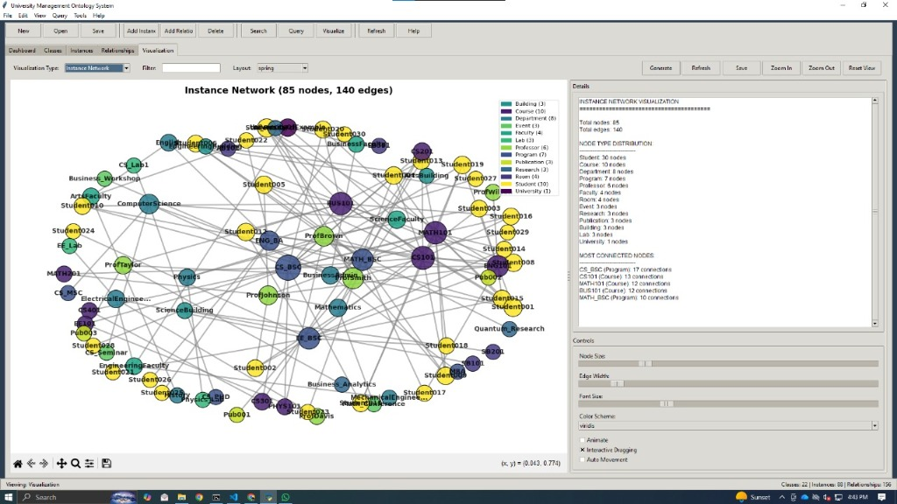
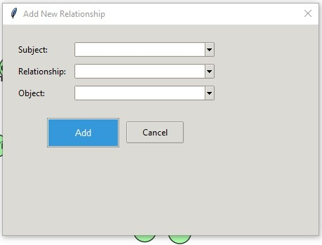
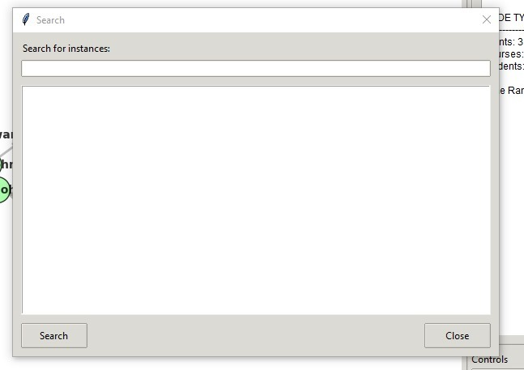

# University Management Ontology System

A comprehensive ontology management system built with Python, designed to manage and visualize university data structures including classes, instances, and relationships.



## Features

- **Dashboard**: Get a quick overview of your ontology statistics, including classes, instances, relationships, and properties.
- **Visualizer**: Interactive graph visualization of the ontology network using NetworkX.
- **Instance Management**: Add and manage instances with properties.
- **Relationship Management**: Define relationships between different instances.
- **Search & Query**: Powerful search functionality to find specific instances and data.
- **Ontology Operations**: Supports RDF/OWL based ontology operations.

## Installation

1.  **Clone the repository:**
    ```bash
    git clone <repository-url>
    cd university-ontology-system
    ```

2.  **Install dependencies:**
    Ensure you have Python 3.x installed.
    ```bash
    pip install -r requirements.txt
    ```

## Usage

Run the main application:

```bash
python main.py
```

## Screenshots

### Network Visualization
Explore the connections between different entities in your university dataset.


### Add New Instance
Easily add new students, professors, courses, or other entities.


### Define Relationships
Connect your data points with meaningful relationships (e.g., *teaches*, *enrolled_in*).


### Search
Quickly locate specific information within your ontology.


## Technologies

-   **Python 3**: Core programming language.
-   **Tkinter**: GUI framework.
-   **RDFLib**: For working with RDF data.
-   **NetworkX**: For graph creation and manipulation.
-   **Matplotlib**: For graph visualization.
-   **Pandas**: For data manipulation.
